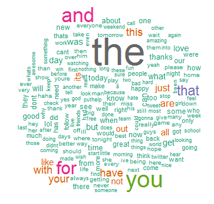

<a name="top"/></a>

## Executive Summary

This is the R Markdown document for **<a target="_blank" href="https://class.coursera.org/dsscapstone-006/">Data Science Capstone</a>** assignment course.
It contains an explanation about my Report Submission as a milestone in the evolution to Data Science Specialization final project.

The data for this analysis comes from a corpus called "<a target="_blank" href="http://www.corpora.heliohost.org">HC Corpora</a>".

The main task we have done till now are:

1. Read English corpus and create one sample (30%) from each file;
2. Clean up these samples, removing some features, such as punctuation, extra spaces, numbers, upper-case;
3. Create a main corpus using these sample files with 'tm' package;
4. Tokenizing words until 3-grams, to explore its frequency distribution; do some demonstrative plots;
5. Study and test several NLP packages available in [R], to observe its pros-cons, fails, memory consumption, performance;
6. Think of a more suitable model to predict and respond the project proposal.

<hr style='width:50%; border:solid 1pt #a0a0a0'>

### 1. Loading Data

The dataset was downloaded from the course repository available on: [Capstone Dataset](https://d396qusza40orc.cloudfront.net/dsscapstone/dataset/Coursera-SwiftKey.zip).

I've saved on my desktop in a subdirectory of the main job called "Capstone_Dataset". Under this, there are 4 subfolders to distinct languages (**de** - German, **en** - English, **fi** - Finnish, **ru** - Russian). To each one there are 3 similar files that represents Corpora from SwiftKey - _blogs_, _news_ and _twitter_. They have a large number of sentences and millions of words.

Until this time, I analyzed only the files in English:

<style type="text/css">
th {color:navy;}
td {text-align:center; border-top: solid 1pt #d0d0d0;}
</style>

<table width="70%" style="border:solid 2pt #a0a0a0" align="center">
  <thead><tr><th>Locale</th><th>File</th><th>Size (MB)</th><th>Lines</th><th>Words</th></tr></thead>
<tbody>
  <tr><td>en_US</td><td>blogs</td><td>200.4</td><td>1 010 242</td><td>37,334,131</td></tr>
  <tr><td>en_US</td><td>news</td><td>196.3</td><td>899 288</td><td>34,372,530</td></tr>
<tr><td>en_US</td><td>twitter</td><td>159.4</td><td>2 360 148</td><td>30,373,583</td></tr>
</tbody>
<tfoot>
  <tr><td colspan="2"><b>--- Total ---</b></td><td>556.1</td><td>4 269 678 556</td><td>102,080,244</td></tr>
<tfoot>
</table>

To access the code where I got these coutings, <a target="_blank" href="https://github.com/svicente99/DataScience_Capstone_Report/blob/master/counting_files.R">see this link</a>.
<hr style='width:50%; border:solid 1pt #a0a0a0'>

### 2. Sampling and First Cleaning

To do the sampling of these above files, I created a set of functions stored in this .R script<br> -> <a target="_blank" href="https://github.com/svicente99/DataScience_Capstone_Report/blob/master/sampling.R">sampling.R</a> (click this link to view the source on my GitHub). 

It includes two another scripts: 

* <a target="_blank" href="https://github.com/svicente99/DataScience_Capstone_Report/blob/master/systematic.R">systematic.R</a> => a function for a systematic sample (the method I used to sample these large files);
* <a target="_blank" href="https://github.com/svicente99/DataScience_Capstone_Report/blob/master/clean.text.R">clean.text.R</a> => a set of functions, made by G.Sanchez, to do a first cleaning of these texts: punctuation, extra spaces and lowering case.

A main method called _"read_dataset()"_, read the 3 files (blogs, news and twitter), collected a systematic sample of **30%** size, cleaned and saved in 3 .RDS format files (to _save_ space and future time processing).

* blogs.RDS (27.6 MB)
* news.RDS (27.8 MB)
* twitter.RDS (23.4 MB)

This process was done in 334 minutes (or `r sprintf("%4.1f hrs",334/60)`) and its log was saved in this file: <a target="_blank"  href="https://github.com/svicente99/DataScience_Capstone_Report/blob/master/sampling_output.txt">sampling_output.txt</a>.

<div align="right">&lt;&lt; <a href="#top">Top</a></div>
<hr style='width:50%; border:solid 1pt #a0a0a0'>

### 3. Creating Work Corpus and Second Cleaning

This was the hardest job I had. I got some trouble in order to convert .RDS files to a source for 'tm' _Corpus()_ method. After I did another transformation to provide the entry parameters of 'quanteda' package [method _"corpus()"_]. While I was generating two intermediary .txt files I did a second cleaning, removing some features that can cause trouble in exploratory analysis and NLP processing - tweet chars (hash tags, @), numbers, extra spaces. But some methods from these packages didn't work fine. In _'qdapRegex'_ the methods to remove tweet features did not have good performance. They last a long, long time and I needed to abort their use. I want to solve this from now on.

In order to save time, I checked if part of necessary job was done, before running it.

These are the core code I've used in [R]:

```{r,eval=FALSE}

SAMPLE_DIR  = "./Samples/"
SAMPLE_CLEAN  = "sample_clean.txt"

cFiles <- c("news","twitter","blogs")

# generate 3 txt files with corpora sampling from "Swift Key Dataset", in case of not exists

if(!file.exists(SAMPLE_DIR)) {
  dir.create(SAMPLE_DIR)
  lapply(cFiles, 
    function(i) {
      write.table(objRDS(i), paste0(SAMPLE_DIR,i,".txt"), sep="\t", col.names=FALSE, quote=FALSE, row.names=FALSE, append=TRUE) }
  )
}  
print(paste("Directory",SAMPLE_DIR,"Corpus' created with 3 sample text files."))

# create a primary Corpus, using "tm" package that contains all sample texts (as Source) to be cleaned
# (because cleaning functions for "quanteda' package aren't working fine...)

# generate a clean text file with corpora sampling , in case of not exists

if(!file.exists(SAMPLE_CLEAN)) 
{
  cp <- Corpus(DirSource(SAMPLE_DIR), readerControl = list(language="lat"))
  print("Corpus object's created.")

  #cp <- removeTweetFeatures(cp)
  cp <- removeOtherFeatures(cp, numbers=TRUE, punctuation=FALSE, spaces=TRUE, stopwords=TRUE)
  
  # and now, rewrite these data to another file representing sample Corpora already clean up
  write.table(dfClean, SAMPLE_CLEAN, sep="", col.names=FALSE, quote=FALSE, row.names=FALSE, append=TRUE)
  
  print(paste(SAMPLE_CLEAN,"is generated"))
  print(paste(SAMPLE_CLEAN,"is generated"))
  rm(cp)	# (release memory)
}

# this 'sample clean text file' could be a source to "corpus" method in "quanteda" package
mycorp <- corpus(textfile(SAMPLE_CLEAN))
```

<div align="right">&lt;&lt; <a href="#top">Top</a></div>
<hr style='width:50%; border:solid 1pt #a0a0a0'>

### 4. Exploratory Analysis

Below we show a graph known as "Word Cloud". It's a handy tool to highlight the most frequent words found in these Corpora (I choose 100). After I have removed 'stop words', visually we may say that various tokens prevail; these are: **will**, **said**, **just**, **one**, **get**, **can**, **like**.

[R] function to produce the 'word clout plot, having 'tm' corpus object as parameter:
```{r,eval=FALSE}

library(wordcloud)
library(RColorBrewer)

plot_word_cloud <- function(corp) {
  tdm <- TermDocumentMatrix(corp)
  m <- as.matrix(tdm)
  v <- sort(rowSums(m),decreasing=TRUE)
  d <- data.frame(word = names(v),freq=v)
  pal <- brewer.pal(9, "BuGn")
  pal <- pal[-(1:2)]
  png("wordcloud.png", width=1280,height=800)
  wordcloud(d$word,d$freq, scale=c(8,.3),min.freq=2,max.words=100, random.order=T, rot.per=.15, colors=pal, vfont=c("sans serif","plain"))
  dev.off()
}

```



To construct the 'n-grams' tokens I used the _'tokenize'_ method from _'quanteda'_ package. This is the [R] code excerpt:

```{r,eval=FALSE}
for(i in 1:3) {
  tk <- tokenize(mycorp, ngrams=i, concatenator=',')
  plot_bar_gram( table_tokens(tk), i)
}
```

These are the graphs of distribution of frequency tokens (dfm) that I've got after applying _'quanteda'_ package function _'tokenize'_ (the code above):


The **complete code to produce this Exploratory Analysis** you may see on my <a target="_blank" href="https://github.com/svicente99/DataScience_Capstone_Report">GitHub' repository to this project</a>:

* <a target="_blank" href="https://github.com/svicente99/DataScience_Capstone_Report/blob/master/exploring.R">exploring.R</a>
* <a target="_blank" href="https://github.com/svicente99/DataScience_Capstone_Report/blob/master/plotting.R">plotting.R</a>
* <a target="_blank" href="https://github.com/svicente99/DataScience_Capstone_Report/blob/master/removeFeatures.R">removeFeatures.R</a>

<div align="right">&lt;&lt; <a href="#top">Top</a></div>
<hr style='width:50%; border:solid 1pt #a0a0a0'>

### 5. Next Steps

To enhance prediction modelling and finish my project, I am taking account:

* Evaluate two key aspects that we should keep in mind - the size and runtime of the algorithm.
* Study and learn more about 'quanteda' package possibilities.<br/>
  Among these: 
    - Incorporate a dictionary in this analysis
    - Try to use a thesaurus and antonyms to grow up predicting capacity
* Using or not using 'stopWords' or 'punctuation' when tokenizing. Why?<br>
    - Stop words are an arbitrary choice imposed by the user, and accessing a pre-defined list of words to ignore.
    - Maybe it wouldn't perfectly fit the needs of predicting model.<br/>
      Along the "Quiz 2" answering I perceived that sometimes it was
  absolutely necessary to find the best anwers depending on each case  (if you want to <a target="_blank" href="https://github.com/svicente99/DataScience_Capstone_Quiz2">see my solution, here it is</a>).
* How I could swap easily to other language corpora (to me is very important, because my native language is Portuguese).
* Project and develop the model to run in a Shiny app (shinyapps.io server). Low-memory comsumption.
* Build a predictive model based on the previous data modeling steps.<br/>
  And...
* Evaluate the model for efficiency and accuracy - based on timing to get the answers and certain to predict 1st, 2nd and 3rd words.

<div align="right">&lt;&lt; <a href="#top">Top</a></div>
<div align="left">[ <a target="_blank" href="http://www.supersuporte.com/_pre_work/CapstoneReportSubmission.html">html version</a> ]</div>

Published on `r strftime(Sys.time(),"%Y-%d-%m %l.%M.%S %p, %z(%Z)")`.
<hr style='width:90%; border:solid 2pt #e0e0e0'>
